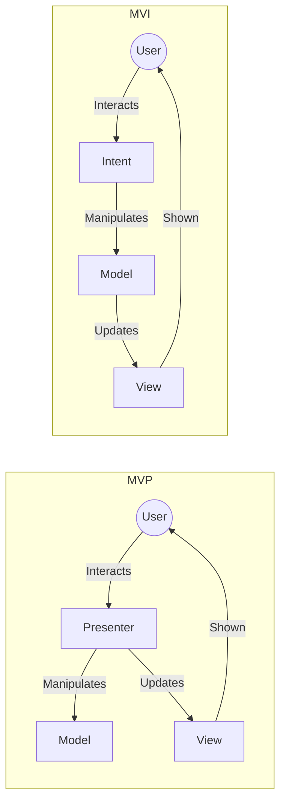

## Patterns

- Model-View-Controller supervising controller

- Model-View-Controller passive view
- Model-View-Presenter
- Model-View-ViewModel
- Model-View-Intent

## Graph

Pictures

## Sources

- https://m.habr.com/en/post/344184/
- https://proandroiddev.com/mvc-mvp-mvvm-clean-viper-redux-mvi-prnsaaspfruicc-building-abstractions-for-the-sake-of-building-18459ab89386
- https://proandroiddev.com/architecture-design-exploring-mvi-from-mvvm-334b773f3921
- https://www.slideshare.net/mudasirqazi00/design-patterns-mvc-mvp-and-mvvm
- https://medium.com/@ankit.sinhal/mvc-mvp-and-mvvm-design-pattern-6e169567bbad
- https://developpaper.com/ten-year-changes-in-gui-application-architecture-mvc-mvp-mvvm-unidirectional-clean/
- https://www.bigdev.de/2014/02/gui-design-patterns-mvc-mvp-vs-mvvm.html
- https://stackoverflow.com/questions/2056/what-are-mvp-and-mvc-and-what-is-the-difference
- https://www.linkedin.com/pulse/evolution-android-architecture-patterns-mv-c-p-vm-i-jetpack-hussain/
- https://stackoverflow.com/questions/59205614/what-is-the-difference-between-mvi-compared-to-mvc-and-mvvm
- https://themindstudios.com/blog/mvp-vs-mvc-vs-mvvm-vs-viper/