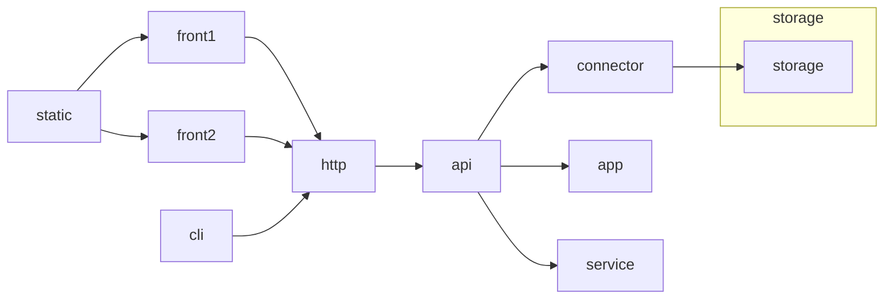

# Infinity Project


## Tiers overview




## Flow

|      |        | http                     | cli      | fs             | .sql + connector | mysql  | mongo |
| ---- | ------ | ------------------------ | -------- | -------------- | ---------------- | ------ | ----- |
| i    | route  | host                     | $0       | disk           |                  | schema |       |
| i    | route  | path                     | $1       | path           | query content    | schema |       |
| i    | meta   | method                   | $2       | mode           |                  |        |       |
| i    | meta   | cookies                  | $user    |                |                  |        |       |
| i    | meta   | etc headers              | opts     |                |                  |        |       |
| i    | data   | req                      | stdin    | data           | data             |        |       |
| o    | status | code                     | status   | status         |                  |        |       |
| o    | meta   | header meta and commands | stderror | *?mode change* |                  |        |       |
| o    | data   | res                      | stdout   | content        |                  |        |       |

## Methods

| fs          | http          |            |            |             |             | cli       | mysql                    | mongo                |
| ----------- | ------------- | ---------- | ---------- | ----------- | ----------- | --------- | ------------------------ | -------------------- |
| <u>mode</u> | <u>method</u> | <u>req</u> | <u>res</u> | <u>safe</u> | <u>idem</u> | <u>$2</u> | <u>statement</u>         | <u>operation</u>     |
| w, w+       | post          | 1          | 1          | 0           | 0           | $2        | create<br />/insert      | insert               |
| a, a+       | put           | 1          | 0          | 0           | 1           | $2        | creatINE<br />/insertINE | insert<br />@indexed |
| r+          | patch         | 1          | 1          | 0           | 0           | $2        | update                   | update               |
| r           | get           | 0          | 1          | 1           | 1           | $2        | select                   | get                  |
| w, rm       | delete        | 1          | 1          | 0           | 1           | $2        | delete                   | remove               |
| stats       | head          | 0          | 0          | 1           | 1           |           |                          |                      |
|             | options       | 0          | 1          | 1           | 1           | --help    |                          |                      |
|             | connect       | 0          | 1          | 0           | 0           |           |                          |                      |
|             | trace         | 0          | 0          | 0           | 1           |           |                          |                      |

cache ~ safe && idem = get+head, options

## Statuses

...

# Tier details

## Front

```mermaid
graph LR
ontology.json["ontology.json<br/>:string{}"]

subgraph wireframe
wireframe.css["wireframe.*css"]
wireframe.html
wireframe.js
wireframe.xml
end

subgraph bundler
cssModules["cssModules:0|1"]
bundler
end

styles.d.ts["styles.d.ts<br>:string?{}"]

subgraph Viewer
Component.tsx
page.tsx
styles.scss
end

util.ts
Fetch.ts

api.schema
fetch["const fetch<br/>:(scope) => any<br/>= require(<br>'./Fetch'<br>)(schema)"]

subgraph DOM
page.html
page.css
end

page.css -.postCss2ts.-> styles.d.ts

page.tsx --> bundler
bundler --> page.html
bundler --> page.css

wireframe.css --> wireframe.js
wireframe.xml --> wireframe.js
wireframe.js --> wireframe.html
ontology.json -.-> wireframe.js
ontology.json --json-importer--> styles.scss
ontology.json -.String.replace.-> styles.d.ts
styles.scss -.css2ts.-> styles.d.ts
ontology.json -.-> wireframe.css

cssModules --> bundler
styles.scss --> bundler
styles.d.ts --import--> page.tsx
wireframe.css --> styles.scss
wireframe.xml --parseXml--> page.tsx

Component.tsx --import--> page.tsx
util.ts --import--> page.tsx

Fetch.ts --> fetch
api.schema --> fetch
fetch --> page.tsx

```
