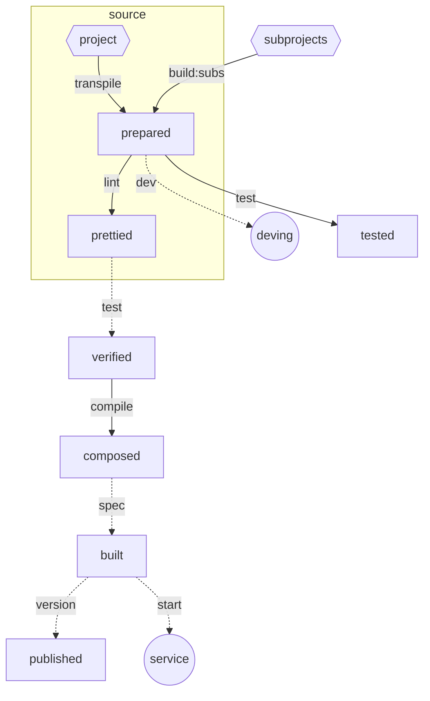

```mermaid
graph TB
subs{{subprojects}}
deving((deving))
service((service))

subgraph source
project{{project}}
prepared
prettied
end

project --transpile--> prepared
subs --build:subs--> prepared

prepared --test--> tested
prepared --lint--> prettied

prepared -.dev.-> deving
prettied -.test.-> verified
verified --compile--> composed
composed -.spec.-> built
built -.version.-> published

built -.start.-> service
```

