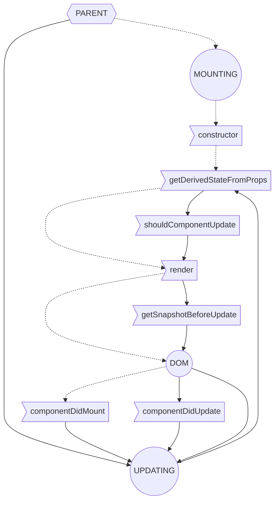

## Phases

## Data flow

### Full view

### Updating

## Data

| method                   | mounting | updating | phase  | props-next | state-next | this.props | this.state | props-pre | state-pre | snapshot | return        |
| ------------------------ | -------- | -------- | ------ | ---------- | ---------- | ---------- | ---------- | --------- | --------- | -------- | ------------- |
| constructor              | 1        |          | render |            |            | arg0       | default    |           |           |          |               |
| getDerivedStateFromProps | 2        | 1        | render |            | return     | arg0       | arg1       |           |           |          | null \| State |
| shouldComponentUpdate    |          | 2        | render | arg0       | arg1       | this       | this       |           |           |          | boolean       |
| render                   | 3        | 3        | render |            |            | this       | this       |           |           |          | JSX           |
| getSnapshotBeforeUpdate  |          | 4        | pre    |            |            | this       | this       | arg0      | arg1      | return   | null \| SS    |
| componentDidMount        | 4        |          | commit |            |            |            |            |           |           |          |               |
| componentDidUpdate       |          | 5        | commit |            |            | this       | this       | arg0      | arg1      | arg2     |               |