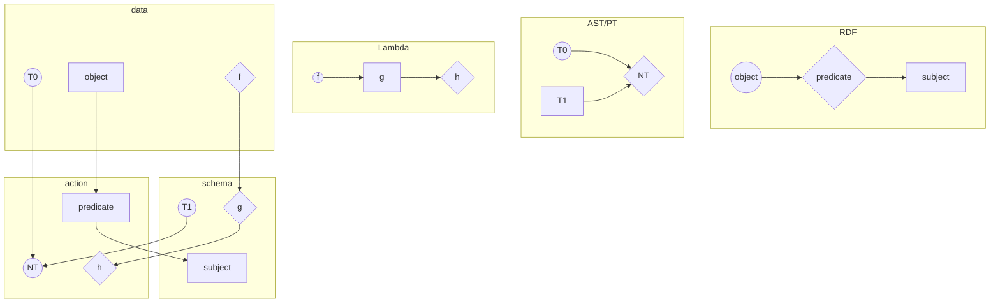

# Schema as Meta-programming

[TOC]

## Relational representation - TBD



## Overview

### Sources

- 04 http://json-schema.org/draft-04/schema
- 06 http://json-schema.org/draft-06/schema
- 07 http://json-schema.org/draft-07/schema

- 04 -> 06 https://json-schema.org/draft-06/json-schema-release-notes.html

- 06 -> 07 https://json-schema.org/draft-07/json-schema-release-notes.html

### Graph

``` mermaid
graph LR
04.$schema=true --> 06.$schema=true
04.$schema=false --> 06.$schema=false
04.id ==rename==> 06.$id
04.$ref ==? describe<br/>instance<br/>properties ?==> 06.$ref
04.type ==*.0 is integer==> 06.type
04.definitions -.- 06.definitions
06.$schema=true -.- 07.Meta
06.$schema=false -.- 07.Meta
06.$ref -.- 07.Meta
06.$id -.- 07.Meta
06.type -.- 07.Meta
06.definitions -.- 07.Meta

04.required=? == <b>? ? ?</b> ==> 06.required=empty
04.enum --"enum[x]"--> 06.const
04.enum -.- 06.enum
06.enum -.- 07.Tupling
06.required=empty -.- 07.Tupling

04.UI -.- 06.UI
06.UI -.- 07.UI
04.default_ -.- 06.UI
04.default_ --> 06.examples
06.examples -.- 07.UI

04.Monad -.- 06.Monad
06.Monad -.- 07.Monad
04.exclusive ==change type==> 06.exclusive
06.exclusive -.- 07.Monad
06.const -.- 07.Monad

04.Logical -.- 06.Logical
06.Logical -.- 07.Logical
04.Logical -.- 06.anyOf
04.dependencies=? == <b>? ? ?</b> ==> 06.dependencies=empty
06.anyOf --> 07.if
06.anyOf -.- 07.Logical
06.contains -.- 07.Logical
06.dependencies=empty -.- 07.Logical

04.Predicate -.- 06.Predicate
06.Predicate -.- 07.Predicate
06.propertyNames -.- 07.Predicate

subgraph draft04
subgraph Meta
subgraph $schema
04.$schema=true["$schema: {}"]
04.$schema=false["$schema: {not: {}}"]
end
04.id[id]
04.$ref["$ref(?)"]
04.type[type]
04.definitions[definitions]
end

subgraph Monad
04.Monad[min/max<br/>multipleOf<hr/>minLength<br/>maxLength<br/>pattern<br/>format<hr/>minItems<br/>maxItems<br/>uniqueItems<hr/>minProperties<br/>maxProperties]
04.exclusive[exclusive<br/>Min and Max<br/>:boolean]
end

subgraph Tupling
04.enum[enum]
subgraph required
04.required=?["required: ?"]
end
end

subgraph UI
04.UI[title<br/> description]
04.default_[default]
end

subgraph Logical
04.Logical[allOf<br/>oneOf<br/>not<br/>anyOf]
subgraph dependencies
04.dependencies=?["dependencies: ?"]
end
end

subgraph Predicate
04.Predicate[items<br/>additionalItems<hr/>properties<br/>additionalProperties<br/>patternProperties]
end

end

subgraph draft06
subgraph Meta
subgraph $schema
06.$schema=true>$schema: true]
06.$schema=false>$schema: false]
end
06.$id[$id]
06.$ref["$ref(?)"]
06.type[type]
06.definitions[definitions]
end

subgraph Predicate
06.Predicate[items<br/>additionalItems<hr/>properties<br/>additionalProperties<br/>patternProperties]
06.propertyNames[<b>propertyNames]
end

subgraph UI
06.UI[title<br/>description<br/>default]
06.examples[examples]
end

subgraph Tupling
subgraph required
06.required=empty["required: []"]
end
06.enum[enum]
end

subgraph Logical
06.Logical[allOf<br/>oneOf<br/>not]
06.anyOf[anyOf]
06.contains[<b>contains]
subgraph dependencies
06.dependencies=empty["dependencies: []"]
end
end

subgraph Monad
06.Monad[min/max<br/>multipleOf<hr/>minLength<br/>maxLength<br/>pattern<br/>format<hr/>minItems<br/>maxItems<br/>uniqueItems<hr/>minProperties<br/>maxProperties]
06.exclusive[exclusive<br/>Min and Max<br/>:number]
06.const>const]
end

end

subgraph draft07
subgraph Meta
07.Meta[$schema<br/>$id<br/>$ref<br/>type<br/>definitions]
end

subgraph UI
07.UI[title<br/>description<br/>default<br/>examples]
07.$comment[<b>$comment]
end

subgraph Predicate
07.Predicate[items<br/>additionalItems<hr/>properties<br/>additionalProperties<br/>patternProperties<br/>propertyNames]
end

subgraph Monad
07.Monad[const<hr/>exclusive<br/>min/max<br/>multipleOf<hr/>minLength<br/>maxLength<br/>pattern<br/>format<hr/>minItems<br/>maxItems<br/>uniqueItems<hr/>minProperties<br/>maxProperties]
end


subgraph Logical
07.Logical[allOf<br/>oneOf<br/>not<br/>anyOf<br/>dependencies<hr/>contains]
07.if><b>if-then-else]
end

subgraph Tupling
07.Tupling[enum<hr/>required]
end

subgraph ???
07.readOnly[<b>readOnly]
07.writeOnly[<b>writeOnly]
07.contentMediaType[<b>contentMediaType]
07.contentEncoding[<b>contentEncoding]
end

end
```

### Legend

#### Meta
##### $schema: uri

##### $id: uri-reference

##### $ref: uri-reference

##### type: string | string[]

##### definitions: Schema{}

#### Tupling
##### required: string[]

##### enum: any[]

#### Monad
##### multipleOf: number

##### maximum: number

##### exclusiveMaximum: number | boolean

##### minimum: number

##### exclusiveMinimum: number | boolean

##### maxLength: number

##### minLength: number

##### pattern: regex

##### maxItems: number

##### minItems: number

##### uniqueItems: boolean

##### maxProperties: number

##### minProperties: number

##### const: any

##### format: string

#### UI
##### title: string

##### description: string

##### $comment: string

##### default: any

##### examples: any[]

#### Logical

= (data, Schema!) => boolean

##### if-then-else

###### : (data, Schema) => boolean

##### allOf, anyOf, oneOf

###### : (data, Schema[]) => boolean

##### not

###### :  (data, Schema) => boolean

##### ? dependencies

###### : Schema | Schema[]

#### Predicate

= (data, Schema!) => (data[k], Schema[k])

##### additionalItems

###### : Schema

##### items

###### : Schema | Schema[]

##### ? contains

###### : Schema

##### additionalProperties

###### : Schema

##### properties

###### : Schema{}

##### patternProperties

###### : Schema{}

##### propertyNames

###### : Schema

#### ???

##### readOnly: boolean

##### writeOnly: boolean

##### contentMediaType: string

##### contentEncoding: string

## Type constraints

| type           | indexOf              | min/max                   | reg               | includes   | special                 |
| -------------- | -------------------- | ------------------------- | ----------------- | ---------- | ----------------------- |
| null           | -                    | -                         | -                 | -          | -                       |
| boolean        | enum                 | ...                       | -                 | -          | -                       |
| number/integer | enum                 | min/max, exclusiveMin/Max | -                 | multipleOf | -                       |
| string         | enum                 | min/maxLength             | pattern, format   | pattern    | -                       |
| array          | additionaltems       | min/maxItems              | -                 | contains   | uniqueItems             |
| object         | additionalProperties | min/maxProperties         | patternProperties | -          | required, propertyNames |
