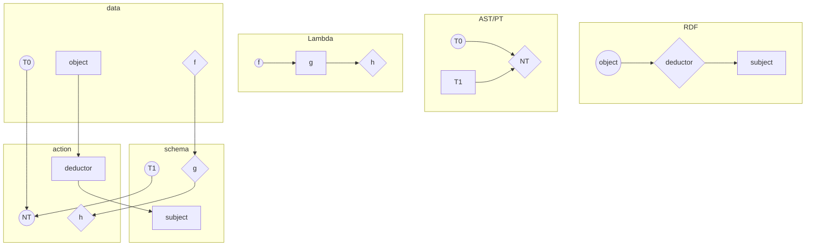
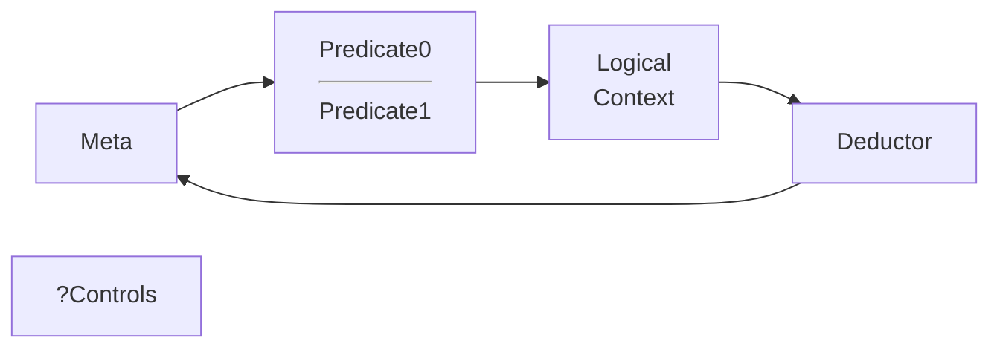

# Schema as Meta-programming

[TOC]

## Relational representation - TBD



## Overview

### Sources

- 04 http://json-schema.org/draft-04/schema
- 06 http://json-schema.org/draft-06/schema
- 07 http://json-schema.org/draft-07/schema

- 04 -> 06 https://json-schema.org/draft-06/json-schema-release-notes.html

- 06 -> 07 https://json-schema.org/draft-07/json-schema-release-notes.html

### Algorithm



### Graph

``` mermaid
graph LR

subgraph draft04
subgraph Meta
subgraph $schema
04.$schema=true["$schema: {}"]
04.$schema=false["$schema: {not: {}}"]
end
04.id[id]
04.$ref["$ref(?)"]
04.definitions[definitions]
04.type[type]
end

subgraph Predicate1
subgraph required
04.required=?["required: ?"]
end
04.enum[enum]
end

subgraph Predicate0
04.exclusive[exclusive<br/>Min and Max<br/>:boolean]
04.Predicate0[min/max<br/>multipleOf<hr/>minLength<br/>maxLength<br/>pattern<br/>format<hr/>minItems<br/>maxItems<br/>uniqueItems<hr/>minProperties<br/>maxProperties]
end


subgraph Logical
04.Logical[anyOf<br/>allOf<br/>oneOf<br/>not]
subgraph dependencies
04.dependencies=?["?dependencies: ?"]
end
end

subgraph Deductor
04.Deductor[items<br/>additionalItems<hr/>properties<br/>additionalProperties<br/>patternProperties]
end

subgraph UI
04.UI[title<br/> description]
04.default_[default]
end

end

subgraph draft06
subgraph Meta
subgraph $schema
06.$schema=true>$schema: true]
06.$schema=false>$schema: false]
end
06.$id[$id]
06.$ref["$ref(?)"]
06.definitions[definitions]
06.type[type]
end


subgraph Predicate1
subgraph required
06.required=empty["required: []"]
end
06.enum[enum]
end

subgraph Predicate0
06.exclusive[exclusive<br/>Min and Max<br/>:number]
06.Predicate0[min/max<br/>multipleOf<hr/>minLength<br/>maxLength<br/>pattern<br/>format<hr/>minItems<br/>maxItems<br/>uniqueItems<hr/>minProperties<br/>maxProperties]
06.const>const]
end

subgraph Logical
06.anyOf[anyOf]
06.Logical[allOf<br/>oneOf<br/>not]
06.contains[<b>?contains]
subgraph dependencies
06.dependencies=empty["?dependencies: []"]
end
end

subgraph Deductor
06.Deductor[items<br/>additionalItems<hr/>properties<br/>additionalProperties<br/>patternProperties]
06.propertyNames[<b>propertyNames]
end

subgraph UI
06.UI[title<br/>description<br/>default]
06.examples[examples]
end

end

subgraph draft07
subgraph Meta
07.Meta[$schema<br/>$id<br/>$ref<br/>type<br/>definitions]
end

subgraph UI
07.UI[title<br/>description<br/>default<br/>examples]
07.$comment[<b>$comment]
end

subgraph Predicate1
07.Predicate1[required<hr/>enum]
end

subgraph Predicate0
07.Predicate0[const<hr/>exclusive<br/>min/max<br/>multipleOf<hr/>minLength<br/>maxLength<br/>pattern<br/>format<hr/>minItems<br/>maxItems<br/>uniqueItems<hr/>minProperties<br/>maxProperties]
end

subgraph Logical
07.if><b>if-then-else]
07.Logical[anyOf<br/>allOf<br/>oneOf<br/>not<hr/>?contains<hr/>?dependencies]
end

subgraph Deductor
07.Deductor[items<br/>additionalItems<hr/>properties<br/>additionalProperties<br/>patternProperties<br/>propertyNames]
end

subgraph ?Controls
07.readOnly[<b>readOnly]
07.writeOnly[<b>writeOnly]
07.contentMediaType[<b>contentMediaType]
07.contentEncoding[<b>contentEncoding]
end

end

04.type ==*.0 is integer==> 06.type
06.type -.- 07.Meta
06.definitions -.- 07.Meta
04.definitions -.- 06.definitions
04.id ==rename==> 06.$id
04.$ref ==? describe<br/>instance<br/>properties ?==> 06.$ref
06.$ref -.- 07.Meta
06.$id -.- 07.Meta
04.$schema=true --> 06.$schema=true
04.$schema=false --> 06.$schema=false
06.$schema=true -.- 07.Meta
06.$schema=false -.- 07.Meta

06.const -.- 07.Predicate0
04.Predicate0 -.- 06.Predicate0
06.Predicate0 -.- 07.Predicate0
04.exclusive ==change type==> 06.exclusive
06.exclusive -.- 07.Predicate0

04.enum -.- 06.enum
04.enum --"enum[x]"--> 06.const
06.enum -.- 07.Predicate1
04.required=? == <b>? ? ?</b> ==> 06.required=empty
06.required=empty -.- 07.Predicate1

04.dependencies=? == <b>? ? ?</b> ==> 06.dependencies=empty
06.contains -.- 07.Logical
06.dependencies=empty -.- 07.Logical
06.Logical -.- 07.Logical
04.Logical -.- 06.anyOf
06.anyOf -.- 07.Logical
06.anyOf --> 07.if
04.Logical -.- 06.Logical

04.Deductor -.- 06.Deductor
06.Deductor -.- 07.Deductor
06.propertyNames -.- 07.Deductor

04.UI -.- 06.UI
06.UI -.- 07.UI
04.default_ -.- 06.UI
04.default_ --> 06.examples
06.examples -.- 07.UI

```

### Legend

#### Meta
##### $schema: uri

##### $id: uri-reference

##### $ref: uri-reference

##### definitions: Schema{}

##### type: (string | string[]) => boolean

#### Predicate1 = (data, any[]) => boolean

##### required: string[]

##### enum: any[]

#### Predicate0 (data, primitive) => boolean
##### multipleOf: number

##### maximum: number

##### exclusiveMaximum: number | boolean

##### minimum: number

##### exclusiveMinimum: number | boolean

##### maxLength: number

##### minLength: number

##### pattern: regex

##### maxItems: number

##### minItems: number

##### uniqueItems: boolean

##### maxProperties: number

##### minProperties: number

##### const: any

##### format: string

#### Logical

= (data, Schema!) => boolean

##### if-then-else

###### : (data, Schema) => boolean

##### allOf, anyOf, oneOf

###### : (data, Schema[]) => boolean

###### oneOf implementation

| index                   |       | 0     | 1     | 2     | 3     | 4     | 5     | 6     | 7     |
| ----------------------- | ----- | ----- | ----- | ----- | ----- | ----- | ----- | ----- | ----- |
| **value**               |       | **0** | **0** | **1** | **0** | **0** | **1** | **0** | **0** |
| acc := !(v && or)       |       | 1     | 1     | 1     | 1     | 1     | 0     |       |       |
| or := v \|\| or         | 0     | 0     | 0     | 1     | 1     | 1     | 1     | 1     | 1     |
| acc ? while : return or |       | ->    | ->    | ->    | ->    | ->    | !     |       |       |
| **result**              | **0** | **0** | **0** | **1** | **1** | **1** | **0** |       |       |

##### not

###### :  (data, Schema) => boolean

##### ? contains

###### : Schema

##### ? dependencies

###### : Schema | Schema[]

#### Deductor

= (data, Schema!) => (data[k], Schema[k])

##### additionalItems

###### : Schema

##### items

###### : Schema | Schema[]

##### additionalProperties

###### : Schema

##### properties

###### : Schema{}

##### patternProperties

###### : Schema{}

##### propertyNames

###### : Schema

#### UI

##### title: string

##### description: string

##### $comment: string

##### default: any

##### examples: any[]

#### ?Controls

##### readOnly: boolean

##### writeOnly: boolean

##### contentMediaType: string

##### contentEncoding: string

## Type constraints

| type           | indexOf              | min/max                   | reg               | includes   | special                 |
| -------------- | -------------------- | ------------------------- | ----------------- | ---------- | ----------------------- |
| null           | -                    | -                         | -                 | -          | -                       |
| boolean        | enum                 | ...                       | -                 | -          | -                       |
| number/integer | enum                 | min/max, exclusiveMin/Max | -                 | multipleOf | -                       |
| string         | enum                 | min/maxLength             | pattern, format   | pattern    | -                       |
| array          | additionaltems       | min/maxItems              | -                 | contains   | uniqueItems             |
| object         | additionalProperties | min/maxProperties         | patternProperties | -          | required, propertyNames |
